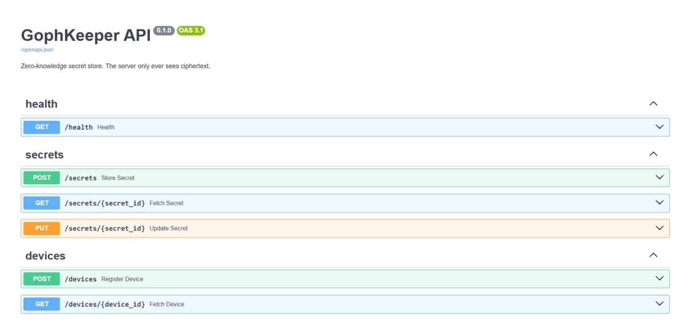

# Sprint 2 Report

## Project Information

### Track

Industrial

### Project

GophKeeper - is a zero-knowledge secret management system designed to securely store, synchronize, and share sensitive information across trusted devices. The project focuses on client-side encryption, ensuring that secret contents are never accessible to the server.

### Team Members and Roles

| Team Member | Role |
|-------------|------|
| Svetlana Maltseva | Team Lead, Product Manager |
| Elina Akhmetzyanova | Design, Documentation |
| Arseny Lashkevich | DevOps Engineer |
| Aleksander Goncharov | CLI Engineer |
| Emil Nabiullin | Frontend Developer |
| Malik Nurullin | Backend Developer  |

## Sprint 2 Goal

Establish the project foundation, define functional requirements, prepare project documentation, create initial user stories, design the MVP architecture, plan the system structure, and set up the development environment for future implementation.

---

## Problem Statement

Most password managers require users to trust the service with their passwords and other sensitive data.
GophKeeper aims to solve this problem by using a Zero-Knowledge approach, where the server cannot read user secrets.
The system will provide secure storage, synchronization, and sharing of secrets between trusted devices.

---

## Industrial Track Justification

### Existing Product / Project

GophKeeper is a secure secret management system focused on storing and synchronizing sensitive information across trusted devices.
Some existing solutions in this area are Bitwarden, 1Password, HashiCorp Vault, and Infisical.

### Identified Gap

Many existing secret management solutions rely on centralized access models and are primarily designed around web interfaces.
GophKeeper focuses on distributed secret management and a CLI-first workflow for DevOps engineers, enabling secure synchronization and sharing of secrets between trusted devices while keeping sensitive data encrypted on the client side.

### Planned Contribution

Develop a distributed secret management system for DevOps engineers and technical users, providing a CLI-first workflow, secure synchronization between trusted devices, and client-side encryption of sensitive data.

### Expected Impact

Improve the security of secret storage while reducing the amount of trust required from users toward the service provider.

---

## Project Plan

### Week-by-Week Roadmap

The roadmap is based on our current understanding of the project and may change during development. As we start implementing specific features, some tasks may require more or less time than initially expected.

#### Week 1

- Team formation
- Project and track selection
- Initial project discussion

#### Week 2

- Project planning
- User stories preparation
- Backlog creation
- UI design
- Project documentation

#### Week 3

- Implement local CRUD operations for secrets
- Add secret version synchronization with the server
- Support basic secret types: login/password pair and free-form text
- Set up the VM for the backend server
- Configure CI/CD
- Create a basic static web application

#### Week 4

- Implement user authorization and user database
- Connect real user data to the overview page
- Collect initial user feedback

#### Week 5

- Implement multi-device functionality
- Work on synchronization between trusted devices
- Improve device access and trust workflow

#### Week 6

- Polish the system
- Fix remaining issues
- Complete unfinished tasks
- Update documentation
- Prepare for the final demo

### Milestones

- Project concept approved
- User stories completed

### Risks

- Limited development time
- Requirement changes during development
  
---

## Backlog

### GitHub Project Board

Project backlog and sprint planning are managed using GitHub Projects.

Link: https://github.com/orgs/svetlana1959/projects/4/views/1

---

## User Stories
---

## Epic A — Authentication & Account Management

### A1) User Registration · Must

**As** a new user  
**I want** to create an account  
**So that** my secrets are private and tied only to me

**Acceptance criteria**

- *Given* a new user provides valid registration data, *when* the user creates an account, *then* the account is created successfully.
- *Given* the email is not used by another account, *when* the user submits registration, *then* the email is accepted as unique.
- *Given* the email already exists in the system, *when* the user tries to register, *then* the account is not created and an error is displayed.
- *Given* the username is not used by another account, *when* the user submits registration, *then* the username is accepted as unique.
- *Given* the username already exists in the system, *when* the user tries to register, *then* the account is not created and an error is displayed.
- *Given* the registration data is valid, *when* the account is created, *then* the account is saved in the system.
- *Given* required fields are empty or invalid, *when* the user submits the form, *then* the system rejects the request and shows a clear validation message.

### A2) User Login · Must

**As** a registered user  
**I want** to log in to my account  
**So that** I can access my encrypted secrets

**Acceptance criteria**

- *Given* a registered user enters valid login information, *when* the user logs in, *then* access to the account is granted.
- *Given* the login is successful, *when* authentication is completed, *then* a token is issued.
- *Given* the login information is invalid, *when* the user tries to log in, *then* an error is displayed.
- *Given* the login information is missing or incomplete, *when* the user submits the login form, *then* the system rejects the request.
- *Given* a user is not authenticated, *when* the user tries to access encrypted secrets, *then* access is denied.

---

## Epic B — Secret Management

### B1) Create Secret · Must

**As** an authenticated user  
**I want** to create a new secret  
**So that** I can securely store sensitive information

**Acceptance criteria**

- *Given* the user is authenticated, *when* the user creates a new secret, *then* the secret is created successfully.
- *Given* the secret contains valid data, *when* the user saves it, *then* the secret is stored in the system.
- *Given* the user saves a secret, *when* data is sent for storage, *then* data is encrypted before storage.
- *Given* required secret fields are empty, *when* the user tries to save the secret, *then* the system rejects the request.
- *Given* the secret is created successfully, *when* the user opens the list of secrets, *then* the new secret is displayed.

### B2) View Secrets · Must

**As** a secret owner  
**I want** to see all available secrets  
**So that** I can quickly access the information I need

**Acceptance criteria**

- *Given* the user is a secret owner, *when* the user opens the secrets section, *then* the user can see a list of their secrets.
- *Given* secrets exist in the system, *when* the list is displayed, *then* the names and basic information are displayed.
- *Given* the user has no secrets, *when* the list is opened, *then* the system displays an empty state.
- *Given* the user is not the owner of a secret, *when* the user opens the list, *then* that secret is not displayed.
- *Given* secrets were changed, *when* the user refreshes or reopens the list, *then* the displayed information is updated.

### B3) Update Secret · Must

**As** a secret owner  
**I want** to update an existing secret  
**So that** my stored information remains accurate and up to date

**Acceptance criteria**

- *Given* the user is a secret owner, *when* the user changes an existing secret, *then* the system allows the update.
- *Given* the changes are valid, *when* the user saves them, *then* the changes are saved.
- *Given* the update is completed, *when* the secret is displayed, *then* the current version is shown.
- *Given* the user enters invalid data, *when* the user tries to save changes, *then* the system rejects the update and shows an error.
- *Given* the user cancels the update, *when* the user leaves the edit mode, *then* no changes are saved.

### B4) Delete Secret · Must

**As** a secret owner  
**I want** to delete a secret  
**So that** I can remove information I no longer need

**Acceptance criteria**

- *Given* the user is a secret owner, *when* the user deletes a secret, *then* the system allows the deletion.
- *Given* the deletion is confirmed, *when* the operation is completed, *then* the deleted secret disappears from the list.
- *Given* the secret is deleted, *when* the operation finishes, *then* the user receives confirmation of the operation.
- *Given* the user cancels deletion, *when* the confirmation step is closed, *then* the secret remains in the list.
- *Given* the user is not the owner of a secret, *when* the user tries to delete it, *then* the operation is rejected.

### B5) Search Secrets · Should

**As** a secret owner  
**I want** to search secrets by name  
**So that** I can quickly find the information I need

**Acceptance criteria**

- *Given* the user has secrets, *when* the user enters a name in search, *then* users can search for secrets by name.
- *Given* the search query matches existing secrets, *when* search is performed, *then* search results are displayed correctly.
- *Given* the search query does not match any secret, *when* search is performed, *then* the system displays that no results were found.
- *Given* the user clears the search field, *when* the field becomes empty, *then* the full list of secrets is displayed again.
- *Given* the user enters lowercase or uppercase text, *when* search is performed, *then* matching results are displayed regardless of letter case.

### B6) Organize Secrets · Could

**As** a secret owner  
**I want** to organize my secrets by type  
**So that** I can manage different kinds of sensitive information more efficiently

**Acceptance criteria**

- *Given* secrets have categories, *when* the user selects a category, *then* the user can view secrets by category.
- *Given* a secret has a type, *when* the secret is displayed, *then* secret types are displayed correctly.
- *Given* the user chooses a type filter, *when* the filter is applied, *then* secrets can be conveniently filtered by type.
- *Given* a secret has no type, *when* the user views it, *then* the system displays it as uncategorized or without a type.
- *Given* the user changes a secret type, *when* the change is saved, *then* the secret appears under the updated type.

### B7) Secret History · Could

**As** a secret owner  
**I want** to view the history of changes to a secret  
**So that** I can understand when and how it was modified

**Acceptance criteria**

- *Given* a secret has changes, *when* the user opens its history, *then* the user can view the change history.
- *Given* a change exists in history, *when* the history is displayed, *then* the date is displayed for each change.
- *Given* a secret has no previous updates, *when* the user opens history, *then* the system displays only the initial creation entry or an empty history state.
- *Given* multiple changes exist, *when* the history is displayed, *then* the changes are shown in chronological order.
- *Given* the user is not the secret owner, *when* the user tries to view history, *then* access is denied.

---

## Epic C — CLI

### C1) CLI Usage · Must

**As** a CLI user  
**I want** to work with the system through CLI commands  
**So that** I can automate secret management workflows

**Acceptance criteria**

- *Given* the user works through the CLI, *when* the user runs a supported command, *then* the user can perform basic operations through CLI.
- *Given* the command is successful, *when* the operation is completed, *then* the CLI returns a success message.
- *Given* the command cannot be completed, *when* an error occurs, *then* the CLI returns an error message.
- *Given* the user provides required command arguments, *when* the command is executed, *then* the requested operation is performed.
- *Given* the user omits required command arguments, *when* the command is executed, *then* the CLI displays usage information.

### C2) Input Validation · Must

**As** a CLI user  
**I want** the application to validate my input data  
**So that** incorrect data does not compromise my secrets

**Acceptance criteria**

- *Given* the input data is incorrect, *when* the user submits it, *then* incorrect data is rejected.
- *Given* input validation fails, *when* the command or form is processed, *then* the user receives an error message.
- *Given* the input data is valid, *when* the user submits it, *then* valid data is processed successfully.
- *Given* a required value is missing, *when* validation runs, *then* the system rejects the request before changing data.
- *Given* invalid data is rejected, *when* the operation ends, *then* no partial or incorrect data is saved.

---

## Epic D — Multi-Device Synchronization

### D1) Synchronization · Must

**As** a multi-device user  
**I want** to synchronize my secrets across devices  
**So that** I always work with the latest version of my data

**Acceptance criteria**

- *Given* the user has more than one device, *when* synchronization runs, *then* data is synced between devices.
- *Given* synchronization is completed, *when* the user opens the data, *then* the most current version of the data is available.
- *Given* synchronization finishes, *when* the result is known, *then* the user receives the sync status.
- *Given* synchronization fails, *when* the failure occurs, *then* the user is notified about the error.
- *Given* data changes on one device, *when* another device synchronizes, *then* the updated data becomes available on that device.

### D2) Multi-device Access · Must

**As** a multi-device user  
**I want** to access my secrets from multiple devices  
**So that** I can work securely from different environments

**Acceptance criteria**

- *Given* the user has trusted devices, *when* the user signs in from them, *then* the user can use multiple devices.
- *Given* a trusted device is synchronized, *when* the user opens the account, *then* data is available on each trusted device.
- *Given* synchronization has completed, *when* the user continues working, *then* access is maintained after synchronization.
- *Given* a device is not trusted, *when* it tries to access secrets, *then* access is denied.
- *Given* a trusted device loses connection, *when* connection is restored and synchronization runs, *then* access continues with the latest available data.

---

## Epic E — Device Trust Management

### E1) Share Access With Trusted Device · Must

**As** a secret owner  
**I want** to securely share access to secrets with another trusted device  
**So that** I can access the same secrets from multiple trusted devices

**Acceptance criteria**

- *Given* the user wants to add a trusted device, *when* an access request is created or received, *then* the user can send or confirm an access request.
- *Given* the access request is confirmed, *when* the process is completed, *then* the new device is added to the trust chain.
- *Given* the device is added to the trust chain, *when* confirmation is completed, *then* the device is granted access.
- *Given* the access request is rejected or ignored, *when* the process ends, *then* the new device is not granted access.
- *Given* a trusted device is added, *when* the device list is opened, *then* the new trusted device is displayed.

### E2) View Devices · Must

**As** a secret owner  
**I want** to see which devices have access to my secrets  
**So that** I can control who can access my data

**Acceptance criteria**

- *Given* devices have access to the account, *when* the user opens device management, *then* the user can see a list of devices.
- *Given* the device list is displayed, *when* the user views it, *then* only devices with access are displayed.
- *Given* there are no trusted devices except the current one, *when* the list is opened, *then* the system displays the available trusted device information.
- *Given* a device was revoked, *when* the device list is refreshed, *then* the revoked device is no longer shown as trusted.
- *Given* the user is not authenticated, *when* the user tries to view devices, *then* access is denied.

### E3) Revoke Device Access · Must

**As** a secret owner  
**I want** to revoke access for a trusted device  
**So that** lost or unused devices cannot access my secrets

**Acceptance criteria**

- *Given* a device is trusted, *when* the user removes it, *then* the user can remove the device from trusted devices.
- *Given* the device is removed from trusted devices, *when* it tries to access data, *then* the device loses access to data.
- *Given* access is revoked, *when* the system updates device information, *then* the changes are reflected in the system.
- *Given* the user cancels revocation, *when* the confirmation step is closed, *then* the device remains trusted.
- *Given* a revoked device tries to synchronize, *when* the request is processed, *then* synchronization is denied.

---

## Epic F — Monitoring & Dashboard

### F1) Dashboard · Should

**As** an authenticated user  
**I want** to view information about my secrets and requests  
**So that** I can monitor the security of my account

**Acceptance criteria**

- *Given* the user is authenticated, *when* the dashboard is opened, *then* the user can see their secrets and requests.
- *Given* information is available, *when* the dashboard loads, *then* the information is displayed correctly.
- *Given* data changes, *when* the dashboard is refreshed or reopened, *then* data is updated after changes.
- *Given* there are no requests, *when* the dashboard is opened, *then* the system displays an empty requests state.
- *Given* the user is not authenticated, *when* the dashboard is requested, *then* access is denied.

### F2) Statistics · Could

**As** an authenticated user  
**I want** to see statistics about my secrets and devices  
**So that** I can monitor my account activity

**Acceptance criteria**

- *Given* the user is authenticated, *when* statistics are opened, *then* the user can see statistics for secrets.
- *Given* the user is authenticated, *when* statistics are opened, *then* the user can see statistics for devices.
- *Given* there is no activity data, *when* statistics are opened, *then* the system displays zero values or an empty state.
- *Given* statistics are updated, *when* the user refreshes the page, *then* the latest statistics are displayed.
- *Given* the user is not authenticated, *when* the user tries to view statistics, *then* access is denied.

---

## Epic G — Backup & Recovery

### G1) Export Data · Should

**As** a security-conscious user  
**I want** to export my encrypted data  
**So that** I can create backups of my secrets

**Acceptance criteria**

- *Given* the user has data to back up, *when* the user starts export, *then* the user can export their data.
- *Given* export is successful, *when* the operation finishes, *then* exported data is saved to a file.
- *Given* data is exported, *when* the file is created, *then* the exported data remains encrypted.
- *Given* export fails, *when* the operation cannot be completed, *then* the user receives a clear error message.
- *Given* the user is not authenticated, *when* export is requested, *then* the operation is denied.

### G2) Restore Data · Should

**As** a security-conscious user  
**I want** to restore my encrypted data from a backup  
**So that** I can recover my secrets if I lose a device

**Acceptance criteria**

- *Given* the user has a backup file, *when* the user starts restoration, *then* the user can download the backup.
- *Given* the backup is valid, *when* restoration is completed, *then* the data is successfully restored.
- *Given* restoration is completed, *when* the user opens the system, *then* the data is available to the user.
- *Given* the backup is invalid or corrupted, *when* the user tries to restore it, *then* the system rejects the backup and shows an error.
- *Given* restoration fails, *when* the operation ends, *then* existing data is not overwritten incorrectly.

---

## Epic H — Stretch - competitive differentiator

### H1) Web overview app · Must

**As** a secret owner  
**I want** a web page showing my account overview  
**So that** I can check status without the CLI

**Acceptance criteria**

- *Given* the user is authenticated, *when* the web overview page is opened, *then* the account overview is displayed.
- *Given* the account overview contains secrets and device information, *when* the page loads, *then* only safe account status information is shown.
- *Given* the user is not authenticated, *when* the web overview page is requested, *then* access is denied.
- *Given* account data changes, *when* the web overview page is refreshed, *then* the updated status is displayed.
- *Given* the user wants to check status without the CLI, *when* the web overview page is available, *then* the user can view the status through the web interface.

### H2) Notify when a password should be changed · Could

**As** a secret owner  
**I want** a notification when a stored password is compromised or stale  
**So that** I act on it

**Acceptance criteria**

- *Given* a stored password is stale, *when* the system checks password status, *then* the user receives a notification that the password should be changed.
- *Given* a stored password is compromised, *when* the system detects the issue, *then* the user receives a notification.
- *Given* the password is not stale or compromised, *when* the check is completed, *then* no warning notification is shown.
- *Given* the user receives a notification, *when* the user opens it, *then* the affected secret is identifiable.
- *Given* the password status cannot be checked, *when* the check fails, *then* the system shows that the status could not be verified.

### H3) Breach-database password check · Could

**As** a secret owner  
**I want** to be warned if a stored password appears in a known breach  
**So that** I can change it.

**Acceptance criteria**

- *Given* a stored password is checked against breach data, *when* the password appears in a known breach, *then* the user is warned.
- *Given* a stored password does not appear in a known breach, *when* the check completes, *then* the system does not show a breach warning.
- *Given* the breach check cannot be completed, *when* the service or check fails, *then* the user receives a clear status message.
- *Given* a warning is shown, *when* the user opens the warning, *then* the user understands that the password should be changed.
- *Given* the user is not the secret owner, *when* the user tries to run or view the breach check, *then* access is denied.

---

## Definition of Done

DoD applies to every story, every sprint.

A story is not closed unless all of these are true:

- Code is merged to the main branch and CI is green
- Unit tests written; project stays on track toward >= 80% coverage
- Every exported function, type, variable, and package is documented
- Security gates: private data is never stored or logged in plaintext; secrets and keys are never committed to git
- Acceptance criteria for the story are demonstrably met

---

## MVP Scope

### In Scope

- Epic A — Account & Authentication
- Epic B — Zero-Knowledge Secret Storage
- Epic C — Multi-Device Trust & Sharing
- Epic D — Synchronization
- Epic E — Account Overview

### Out of Scope

- Backup & Recovery
- Client Metadata
- Password Breach Monitoring
- Password Expiration Notifications
- OTP Support
- Secret Version History

---

## Tech Stack

### Frontend
CLI — GoLang + Cobra, a basic stack for developing the CLI service. The main advantage is the age library for file encryption, written by the algorithm's creator. It's written in Go and has active community support, which makes it probably the safest option out there - and it means we don't have to build anything from scratch on the algorithm side
WebApp — ReactJS with a Vite configuration + Gravity UI + Tailwind CSS for rapid web layout development and builds, plus React Hooks for fast request initialization.

### Backend
Python + FastAPI is the most suitable stack for a simple API and an MVP, since it's familiar to most of the team members

### Database
PostgreSQL with migrations for the global API, as it's designed to handle many users concurrently; and SQLite for local key storage, since in the CLI case we have only one user and therefore no need for a dedicated database server. SQLite stores the database in a local file, which can be easily encrypted

### Infrastructure
GitHub organization "svetlana1959" is used for project management, source code storage, issue tracking, pull requests, and sprint planning through GitHub Projects.
A virtual machine (VM) will be used as the main production server. The VM will host the backend API, PostgreSQL database, and synchronization services responsible for communication between trusted devices.

---

## Design Artifacts

### Wireframes

The following wireframes were prepared:

- Registration Screen
- Login Screen
- User Dashboard
- User Secrets List

### Mockups

UI mockups were created in Figma to demonstrate the planned web interface and main user screens.
### User Flow Diagrams

The image illustrates how users interact with GophKeeper through both the web application and the CLI client, including authentication, secret management, device access, and synchronization.

---

## MVP Features

### Implemented Features

At this stage, the team has defined the project requirements, prepared user stories, identified the MVP scope, and started working on the UI design.
Core functionality implementation is planned for the next stages of the project.

### Functional User Journeys

User journeys are currently being developed based on the approved user stories and MVP requirements.

### Screenshots / GIFs

#### Registration Screen

#### Login Screen

#### Dashboard

#### User Secrets List

---

## Baseline Comparison

The project was compared with several existing secret management solutions: Bitwarden, 1Password, HashiCorp Vault, and Infisical.

| Dimension | Bitwarden | 1Password | HashiCorp Vault | Infisical | GophKeeper |
|---|---|---|---|---|---|
| Primary use case | Human password management | Human password management | Machine and DevOps secrets | Machine and DevOps secrets | Distributed secret management for technical users |
| Zero-knowledge approach | Yes | Yes | No | Partial | Yes |
| Client-side encryption | Yes | Yes | No | Partial | Yes |
| Self-hosting | Yes | No | Yes | Yes | Planned |
| DevOps-oriented workflow | Limited | Limited | Strong | Strong | CLI-first approach |
| Trusted device synchronization | Limited | Limited | Not a core focus | Not a core focus | Core feature |
| Ease of use | High | High | More complex | Medium | Planned to be simple for CLI users |

### Initial Measurement

Existing tools usually focus either on human password management or on DevOps and machine secrets.

Bitwarden and 1Password provide strong zero-knowledge protection, but they are primarily focused on human password management. HashiCorp Vault and Infisical offer more advanced functionality for DevOps workflows, but they are not centered around a zero-knowledge approach in all scenarios.
GophKeeper combines distributed secret management, client-side encryption, trusted-device synchronization, and a CLI-first workflow for technical users.
The project is designed to support secret storage and synchronization across multiple trusted devices while maintaining a zero-knowladge architecture.

---

## Relevant Links

### Issues
- Issue #50 – Prepare Web UI Design
  https://github.com/orgs/svetlana1959/projects/4/views/1?pane=issue&itemId=198034715&issue=svetlana1959%7CGophKeeper%7C50
- Issue #19 – Write Sprint 2 Report
  https://github.com/orgs/svetlana1959/projects/4/views/1?pane=issue&itemId=196727524&issue=svetlana1959%7CGophKeeper%7C19
- Issue #27 – Create /api/v1/store and /api/v1/device endpoints
  https://github.com/orgs/svetlana1959/projects/4/views/1?pane=issue&itemId=197206217&issue=svetlana1959%7CGophKeeper%7C27
- Issue #35 - Write User Stories
  https://github.com/orgs/svetlana1959/projects/4/views/1?pane=issue&itemId=197587603&issue=svetlana1959%7CGophKeeper%7C35
- Issue #20 - Create Backlog
  https://github.com/orgs/svetlana1959/projects/4/views/1?pane=issue&itemId=196727719&issue=svetlana1959%7CGophKeeper%7C20
- Issue #34 - Backend database setup
  https://github.com/orgs/svetlana1959/projects/4/views/1?pane=issue&itemId=197278922&issue=svetlana1959%7CGophKeeper%7C34

### Pull Requests
- PR #58 feat: api endpoints
  https://github.com/svetlana1959/GophKeeper/pull/58
- PR #59 docs: update user stories
  https://github.com/svetlana1959/GophKeeper/pull/59
  
### API Documentation

The API follows the OpenAPI 3.1 standard. Interactive documentation is available at:  
http://localhost:8081/docs

## Main Endpoints

| Method | Endpoint | Description |
|--------|----------|-------------|
| GET | /health | Service health check |
| POST | /secrets | Store a new secret |
| GET | /secrets/{id} | Retrieve a secret by ID |
| PUT | /secrets/{id} | Update an existing secret |
| POST | /devices | Register a new device |
| GET | /devices/{id} | Retrieve a device by ID |

---

### Next Steps
- Complete UI mockups
- Finalize MVP scope
- Finalize web design
- Implement local CRUD operations for secrets
- Add secret version synchronization with the server
- Support basic secret types: login/password pair and free-form text
- Set up the VM for the backend server
- Configure CI/CD
- Create a basic static web application
