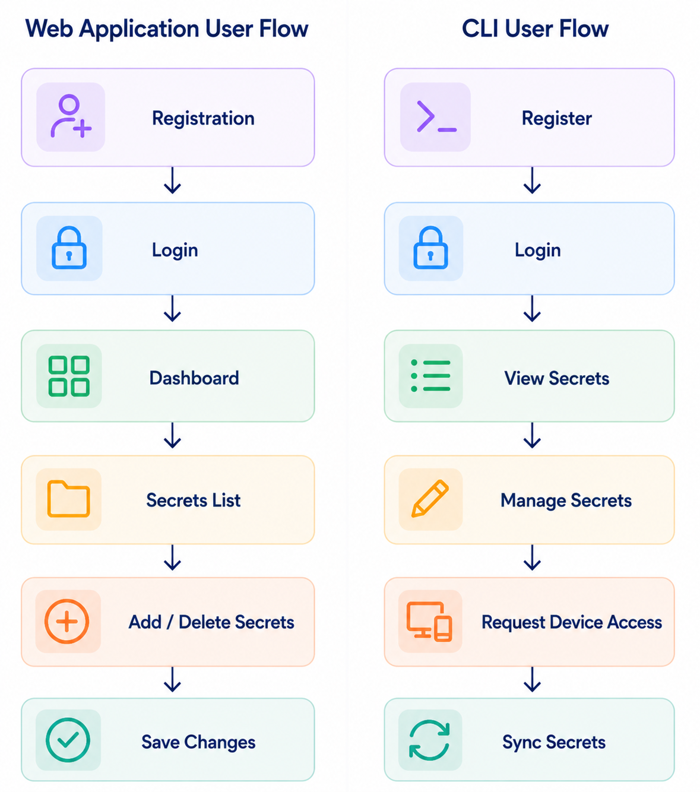
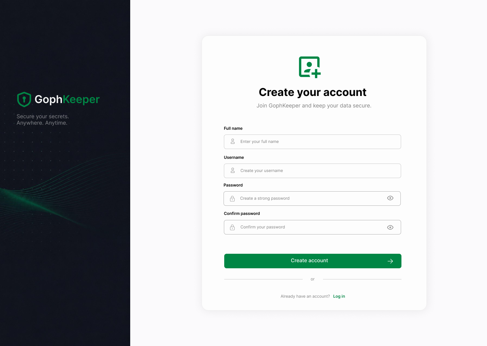
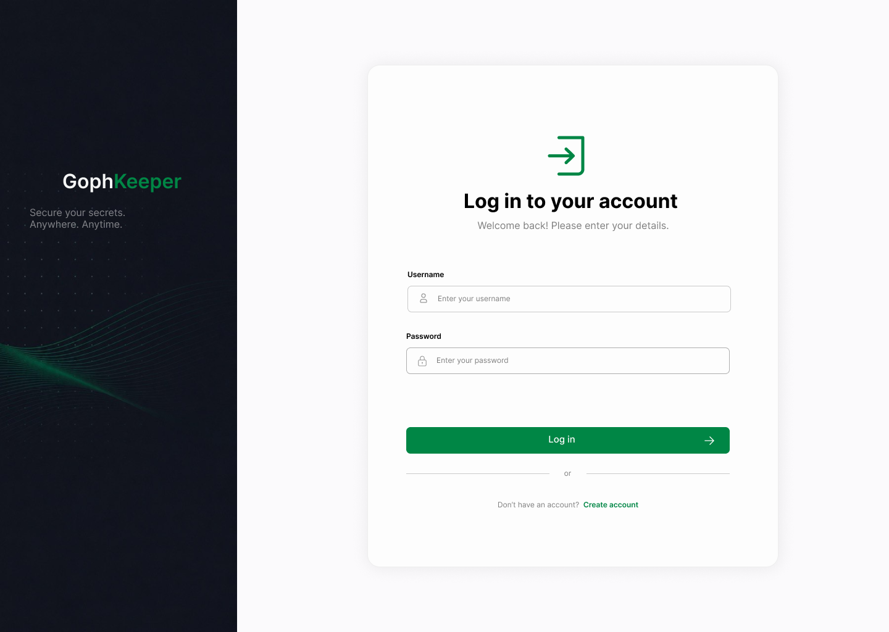
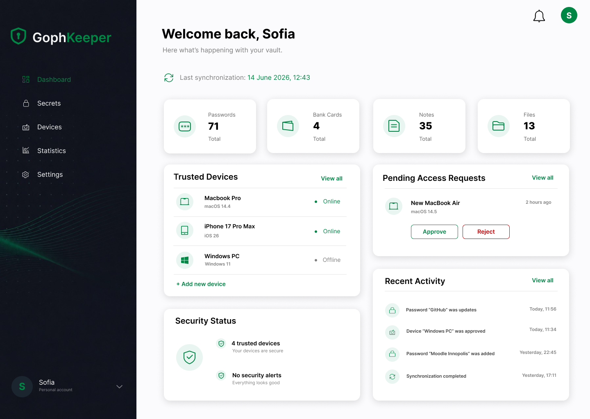

# Sprint 2 Report

## Project Information

### Track

Industrial

### Project

GophKeeper - is a zero-knowledge secret management system designed to securely store, synchronize, and share sensitive information across trusted devices. The project focuses on client-side encryption, ensuring that secret contents are never accessible to the server.

### Team Members and Roles

| Team Member | Role |
|-------------|------|
| Svetlana Maltseva | Team Lead, Product Manager |
| Elina Akhmetzyanova | Design, Documentation |
| Arseny Lashkevich | DevOps Engineer |
| Aleksander Goncharov | CLI Engineer |
| Emil Nabiullin | Frontend Developer |
| Malik Nurullin | Backend Developer  |

## Sprint 2 Goal

Establish the project foundation, define functional requirements, prepare project documentation, create initial user stories, design the MVP architecture, plan the system structure, and set up the development environment for future implementation.

---

## Problem Statement

Most password managers require users to trust the service with their passwords and other sensitive data.
GophKeeper aims to solve this problem by using a Zero-Knowledge approach, where the server cannot read user secrets.
The system will provide secure storage, synchronization, and sharing of secrets between trusted devices.

---

## Industrial Track Justification

### Existing Product / Project

GophKeeper is a secure secret management system focused on storing and synchronizing sensitive information across trusted devices.
Some existing solutions in this area are Bitwarden, 1Password, HashiCorp Vault, and Infisical.

### Identified Gap

Many existing secret management solutions rely on centralized access models and are primarily designed around web interfaces.
GophKeeper focuses on distributed secret management and a CLI-first workflow for DevOps engineers, enabling secure synchronization and sharing of secrets between trusted devices while keeping sensitive data encrypted on the client side.

### Planned Contribution

Develop a distributed secret management system for DevOps engineers and technical users, providing a CLI-first workflow, secure synchronization between trusted devices, and client-side encryption of sensitive data.

### Expected Impact

Improve the security of secret storage while reducing the amount of trust required from users toward the service provider.

---

## Project Plan

### Week-by-Week Roadmap

The roadmap is based on our current understanding of the project and may change during development. As we start implementing specific features, some tasks may require more or less time than initially expected.

#### Week 1

- Team formation
- Project and track selection
- Initial project discussion

#### Week 2

- Project planning
- User stories preparation
- Backlog creation
- UI design
- Project documentation

#### Week 3

- Implement local CRUD operations for secrets
- Add secret version synchronization with the server
- Support basic secret types: login/password pair and free-form text
- Set up the VM for the backend server
- Configure CI/CD
- Create a basic static web application

#### Week 4

- Implement user authorization and user database
- Connect real user data to the overview page
- Collect initial user feedback

#### Week 5

- Implement multi-device functionality
- Work on synchronization between trusted devices
- Improve device access and trust workflow

#### Week 6

- Polish the system
- Fix remaining issues
- Complete unfinished tasks
- Update documentation
- Prepare for the final demo

### Milestones

- Project concept approved
- User stories completed

### Risks

- Limited development time
- Requirement changes during development
  
---

## Backlog

### GitHub Project Board

Project backlog and sprint planning are managed using GitHub Projects.

Link: https://github.com/orgs/svetlana1959/projects/4/views/1

---

## User Stories

### Epic A — Account & Authentication

#### A1. Create an Account

As a new user, I want to create an account, so that my secrets are private and tied only to me.

**Acceptance Criteria:**

- A user registers with a login and master password via the CLI.
- The master password is hashed (bcrypt/argon2), never stored in plaintext or recoverable.
- Duplicate logins are rejected with a clear message.

#### A2. Log In

As a registered user, I want to log in, so that only I can access my secrets.

**Acceptance Criteria:**

- Valid credentials authenticate the user against the server.
- Invalid credentials are rejected without revealing which field was wrong.

---

### Epic B — Zero-Knowledge Secret Storage

#### B1. Store a Login/Password Pair

As a user, I want to store a login and password with metadata, so that I do not have to remember it.

**Acceptance Criteria:**

- Payload is encrypted client-side with age before leaving the device.
- The server stores only ciphertext, never plaintext passwords.
- Arbitrary text metadata can be attached.

#### B2. Store Free Text

As a user, I want to store an arbitrary text note, so that I can keep secure notes alongside my passwords.

#### B3. Store Binary Data

As a user, I want to store an arbitrary file, so that I can keep keys, certificates, and documents safe.

**Acceptance Criteria:**

- Large payloads are handled correctly.
- Files are encrypted client-side before upload.
- Metadata distinguishes files from other secret types.

#### B4. Store Bank Card Data

As a user, I want to store bank card details, so that I have them available securely.

**Acceptance Criteria:**

- Card number, expiry date, CVV, and cardholder name are stored as encrypted fields.
- Input is validated before saving.

#### B5. Update a Secret

As a user, I want to update an existing secret, so that my stored information stays accurate.

#### B6. Delete a Secret

As a user, I want to delete a secret, so that I can remove information I no longer need.

#### B7. List All Secrets

As a user, I want to see all my secrets, so that I can find what I need.

**Acceptance Criteria:**

- Listing displays metadata such as secret name and type.
- Secret contents are not decrypted unless explicitly requested.

#### B8. Organize / Filter Secrets by Type

As a user with many secrets, I want to view my secrets grouped or filtered by type, so that I can manage different kinds of information efficiently.

**Acceptance Criteria for B1–B5:**

- Invalid input (empty required fields, malformed card numbers, etc.) is rejected with a clear error before anything is saved.

---

### Epic C — Multi-Device Trust & Sharing

#### C1. Request Access from a New Device

As a user on a new device, I want to request access to my vault, so that an already trusted device can grant it.

#### C2. View Pending Access Requests

As a user on a trusted device, I want to see pending access requests, so that I can review them before granting access.

#### C3. Approve an Access Request

As a user on a trusted device, I want to approve a request, so that the new device is added to the trust chain.

#### C4. First Sync After Approval

As a user on the newly approved device, I want my secrets to appear and decrypt, so that I can use the vault immediately.

#### C5. View Trusted Devices

As a user, I want to see which devices are in my trust chain, so that I can control who can read my data.

#### C6. Revoke Device Access

As a user, I want to revoke access for a device, so that a lost or retired device can no longer read my secrets.

---

### Epic D — Synchronization

#### D1. Automatic Sync Across Devices

As a user with more than one trusted device, I want my secrets to sync automatically, so that every device shows the latest version.

#### D2. Conflict Resolution

As a user who edited the same secret on two devices, I want the system to detect conflicts instead of silently overwriting changes, so that I never lose data.

**Acceptance Criteria:**

- Concurrent edits are detected.
- The second conflicting update is rejected.
- The client must pull the latest version before re-applying changes.
- Unrelated secrets remain unaffected.

#### D3. Synchronization Status

As a user, I want to know whether my last synchronization succeeded, so that I can trust my data is up to date.

---

### Epic E — Account Overview

#### E1. Account Overview

As a user, I want an overview of my secrets, trusted devices, and pending requests, so that I can quickly monitor my account.

**Acceptance Criteria:**

- Displays total secret count.
- Displays trusted devices.
- Displays pending access request count.
- Displays last synchronization time.

---

## MVP Scope

### In Scope

- Epic A — Account & Authentication
- Epic B — Zero-Knowledge Secret Storage
- Epic C — Multi-Device Trust & Sharing
- Epic D — Synchronization
- Epic E — Account Overview

### Out of Scope

- Backup & Recovery
- Client Metadata
- Password Breach Monitoring
- Password Expiration Notifications
- OTP Support
- Secret Version History

---

## Tech Stack

### Frontend
CLI — GoLang + Cobra, a basic stack for developing the CLI service. The main advantage is the age library for file encryption, written by the algorithm's creator. It's written in Go and has active community support, which makes it probably the safest option out there - and it means we don't have to build anything from scratch on the algorithm side
WebApp — ReactJS with a Vite configuration + Gravity UI + Tailwind CSS for rapid web layout development and builds, plus React Hooks for fast request initialization.

### Backend
Python + FastAPI is the most suitable stack for a simple API and an MVP, since it's familiar to most of the team members

### Database
PostgreSQL with migrations for the global API, as it's designed to handle many users concurrently; and SQLite for local key storage, since in the CLI case we have only one user and therefore no need for a dedicated database server. SQLite stores the database in a local file, which can be easily encrypted

### Infrastructure
GitHub organization "svetlana1959" is used for project management, source code storage, issue tracking, pull requests, and sprint planning through GitHub Projects.
A virtual machine (VM) will be used as the main production server. The VM will host the backend API, PostgreSQL database, and synchronization services responsible for communication between trusted devices.

---

## Design Artifacts

### Wireframes

The following wireframes were prepared:

- Registration Screen
- Login Screen
- User Dashboard
- User Secrets List

### Mockups

UI mockups were created in Figma to demonstrate the planned web interface and main user screens.
### User Flow Diagrams

The image illustrates how users interact with GophKeeper through both the web application and the CLI client, including authentication, secret management, device access, and synchronization.

---

## MVP Features

### Implemented Features

At this stage, the team has defined the project requirements, prepared user stories, identified the MVP scope, and started working on the UI design.
Core functionality implementation is planned for the next stages of the project.

### Functional User Journeys

User journeys are currently being developed based on the approved user stories and MVP requirements.

### Screenshots / GIFs

#### Registration Screen

#### Login Screen

#### Dashboard

#### User Secrets List

---

## Baseline Comparison

The project was compared with several existing secret management solutions: Bitwarden, 1Password, HashiCorp Vault, and Infisical.

| Dimension | Bitwarden | 1Password | HashiCorp Vault | Infisical | GophKeeper |
|---|---|---|---|---|---|
| Primary use case | Human password management | Human password management | Machine and DevOps secrets | Machine and DevOps secrets | Distributed secret management for technical users |
| Zero-knowledge approach | Yes | Yes | No | Partial | Yes |
| Client-side encryption | Yes | Yes | No | Partial | Yes |
| Self-hosting | Yes | No | Yes | Yes | Planned |
| DevOps-oriented workflow | Limited | Limited | Strong | Strong | CLI-first approach |
| Trusted device synchronization | Limited | Limited | Not a core focus | Not a core focus | Core feature |
| Ease of use | High | High | More complex | Medium | Planned to be simple for CLI users |

### Initial Measurement

Existing tools usually focus either on human password management or on DevOps and machine secrets.

Bitwarden and 1Password provide strong zero-knowledge protection, but they are primarily focused on human password management. HashiCorp Vault and Infisical offer more advanced functionality for DevOps workflows, but they are not centered around a zero-knowledge approach in all scenarios.
GophKeeper combines distributed secret management, client-side encryption, trusted-device synchronization, and a CLI-first workflow for technical users.
The project is designed to support secret storage and synchronization across multiple trusted devices while maintaining a zero-knowladge architecture.

---

## Relevant Links

### Issues
- Issue #50 – Prepare Web UI Design
  https://github.com/orgs/svetlana1959/projects/4/views/1?pane=issue&itemId=198034715&issue=svetlana1959%7CGophKeeper%7C50
- Issue #19 – Write Sprint 2 Report
  https://github.com/orgs/svetlana1959/projects/4/views/1?pane=issue&itemId=196727524&issue=svetlana1959%7CGophKeeper%7C19
- Issue #27 – Create /api/v1/store and /api/v1/device endpoints
  https://github.com/orgs/svetlana1959/projects/4/views/1?pane=issue&itemId=197206217&issue=svetlana1959%7CGophKeeper%7C27
- Issue #35 - Write User Stories
  https://github.com/orgs/svetlana1959/projects/4/views/1?pane=issue&itemId=197587603&issue=svetlana1959%7CGophKeeper%7C35
- Issue #20 - Create Backlog
  https://github.com/orgs/svetlana1959/projects/4/views/1?pane=issue&itemId=196727719&issue=svetlana1959%7CGophKeeper%7C20
- Issue #34 - Backend database setup
  https://github.com/orgs/svetlana1959/projects/4/views/1?pane=issue&itemId=197278922&issue=svetlana1959%7CGophKeeper%7C34

### Pull Requests
- PR #58 feat: api endpoints
  https://github.com/svetlana1959/GophKeeper/pull/58
- PR #59 docs: update user stories
  https://github.com/svetlana1959/GophKeeper/pull/59
### API Documentation

---

## Next Steps

- Complete UI mockups
- Finalize MVP scope
- Finalize web design
- Implement local CRUD operations for secrets
- Add secret version synchronization with the server
- Support basic secret types: login/password pair and free-form text
- Set up the VM for the backend server
- Configure CI/CD
- Create a basic static web application
